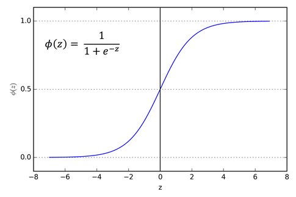
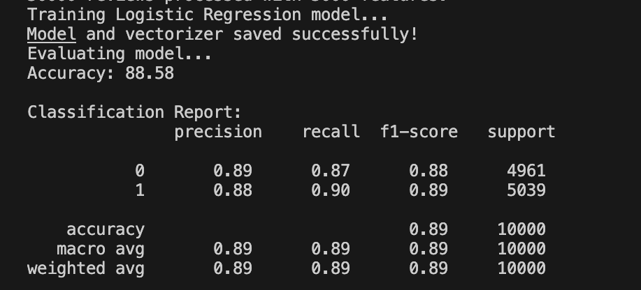
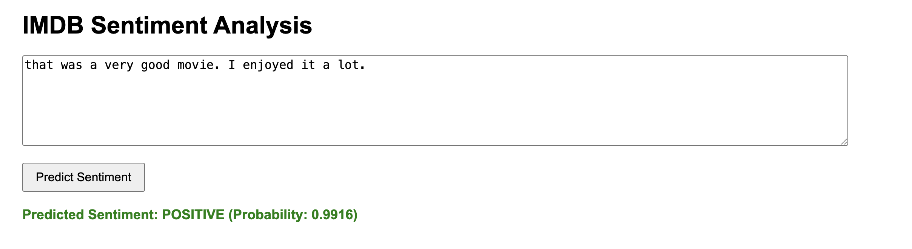
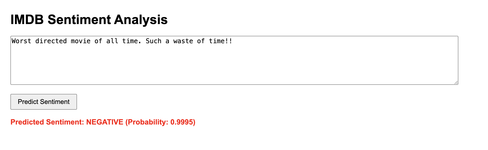

# Sentiment-Analysis Using Logistic Regression Classifier

This is a beginner-friendly Machine Learning project for those who want to understand the basics of ML concepts and workflows. It demonstrates **Sentiment Analysis** using a **Logistic Regression Classifier**. The project loads an IMDB reviews dataset, trains the classifier and evaluates its performance.

---

## Table of Contents

- [Objective](#objective)  
- [Dataset](#dataset)  
- [Data Preprocessing](#data-preprocessing)  
- [Feature Extraction](#feature-extraction)  
- [Training and Evaluaion](#training-and-evaluation)
- [Results](#results)  
- [Project Structure](#project-structure) 
- [Installation](#installation)  
- [Usage](#usage) 
- [Output Sample](#output-sample)  
- [Future Improvements](#future-improvements)    
- [License](#license)  
- [Contact](#contact)

---

## Objective

The objective of the project is to automatically classify a given text review as **positive** or **negative**. For example:
- "That was a great movie" --> Positive
- "The movie was slow and boring" --> Negative 

---

## Dataset

The project uses a **IMDB Review Dataset** of 50000 labeled reviews (balanced between positive and negative). The dataset has two columns:

**Reviews**: Text Reviews

**Sentiment**: the label (positive or negative)

You can download the dataset from [here](https://www.kaggle.com/datasets/lakshmi25npathi/imdb-dataset-of-50k-movie-reviews).

---

## Data Preprocessing

It is important that our dataset is free from errors to generate a high quality model. The **preprocessing** for our dataset includes following steps:
- Handling missing values
- Removing the HTML tags if any
- Removing special characters in the text
- Converting all the characters in lowercase
- Removing stop words that that do not contribute in sentiment like a, the, for, and, is and so on.
- Lemmatizing/Stemming i.e. reducing the words in their root form like surprising to surprise

---

## Feature Extraction

After the pre processing step is complete we are left with a clean and ready to train dataset. Then the next step is **feature extraction**. The goal here is to extract sentiment heavy words as much as possible. Since the model does not understand text, we need a way to convert the words into numeric value. For this we will use Scikit learn's **TF-IDF Vectorizer**.

### What is TF-IDF Vectorizer?

It stands for Term Frequency - Inverse Document Frequency Vectorizer. It balances word frequency against uniqueness across the dataset. This means a frequently appearing word like *movie* is assigned a low score whereas other words like *good*, *fantastic*, *boring*, *slow* which are sentiment heavy are assigned high score so that at the end we know which are the most significant features and which are the least.

## Training and Evaluation

For training, we use **Logistic Regression**, a simple yet powerful linear model for binary classification. 

### What is Logistic Regression Classifier?



Logistic Regression is a linear model commonly used for binary classification problems such as predicting positive or negative sentiment in our project. The model works by estimating the probability that a given input (e.g., a text review) belongs to a particular class. As shown in above figure, it applies a sigmoid (logistic) function to map the weighted sum of input features into a probability score between 0 and 1:

P(y=1|x) = 1 / (1 + exp(-(w · x + b)))

where:
x = feature vector (i.e. TF-IDF representation of text)
w = learned weights
b = bias term
P(y=1∣x) = probability that the input belongs to the positive class

Based on a chosen threshold (commonly 0.5), the model assigns the input to either the positive or negative sentiment class. In this project, text review was first converted into numerical feature representations i.e. TF-IDF, and then fed into the Logistic Regression classifier.

### Evaluation

Once trained, the model is tested on a validation set to measure its accuracy.  

We compute performance metrics such as:  
- **Accuracy**  
- **Precision, Recall, F1-score**
- **Confusion Matrix**

---

## Results

Example evaluation result:  



---

## Project Structure
```bash
project/
├── src/
│   ├── data_preprocess.py 
│   ├── feature_extractor.py 
│   ├── main.py       # Script to train and save the model
│   └── train_evaluate_model.py    # Script to evaluate the model
├── dataset/          # Training dataset
│   └── imdb_dataset.csv
├── models/
│   └── sentiment_model.pkl
|   └── tfidf_vectorizer.pkl
├── Pipfile
├── Pipfile.lock
├── templates
    └── index.html
├── app.py
└── README.md
```
---

## Installation

1. **Clone the repository:**

```bash
git clone https://github.com/ranjan0369/Sentiment-Analysis.git
cd Sentiment-Analysis
```

2. **Install dependencies using Pipenv:**
```bash
pip install pipenv
pipenv install --dev
```

3. **Activate the Pipenv shell:**
```bash
pipenv shell
```
---

## Usage
**Train and Evaluate the model:**
```bash
python src/data_preprocess.py
python src/feature_extractor.py
python train_evaluate_model.py
```
If you want to run all the script at once, please run the following command
```bash
python src/main.py
```
This does the following:

- Trains Logistic Regression Classifier on the dataset.

- Saves the trained model and vectorizers in models folder.

- Loads the saved model and evaluates accuracy on the validation set.

- Prints validation accuracy to the console.

**Run Flask API**

The project also include flask API and GUI so that user can enter a text review and get prediction. Run the following command to start the api:
```bash
python app.py
```
By default the api will be available at
```bash
http://127.0.0.1:5000/
```
---


## Output Sample




---

## Future Improvements

- Experiment with advanced classifiers (Decision Tree, Random Forest, Naive Bayes)

- Use deep learning models (e.g., LSTM, BERT) for higher accuracy

- Perform hyperparameter tuning for Logistic Regression

- Add cross-validation for more robust evaluation

---

## License

MIT License – free to use and modify for personal, academic, or professional purposes.

---

## Contact

For questions or collaborations, reach out to Ranjan Shrestha: [ranjan.shrestha0369@gmail.com]
